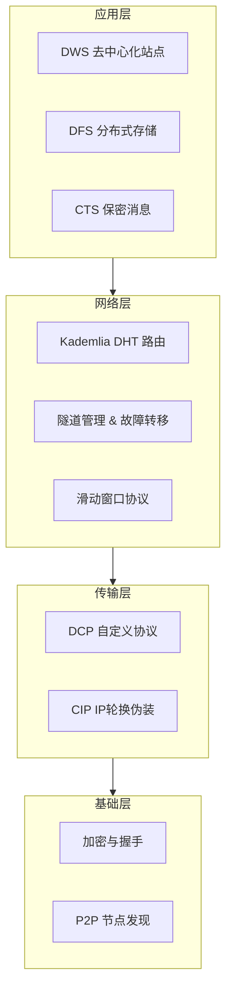

## 架构概览

`simple-dec-network` 采用分层设计，各层协同工作以实现去中心化通信。

```mermaid
graph TD
    subgraph 应用层 [应用层]
        DWS[DWS 去中心化站点]
        DFS[DFS 分布式存储]
        CTS[CTS 保密消息]
    end

    subgraph 网络层 [网络层]
        DHT[Kademlia DHT 路由]
        Tunnel[隧道管理 & 故障转移]
        Window[滑动窗口协议]
    end

    subgraph 传输层 [传输层]
        DCP[DCP 自定义协议]
        CIP[CIP IP轮换伪装]
    end

    subgraph 基础层 [基础层]
        Crypto[加密与握手]
        P2P[P2P 节点发现]
    end

    应用层 --> 网络层
    网络层 --> 传输层
    传输层 --> 基础层
```
